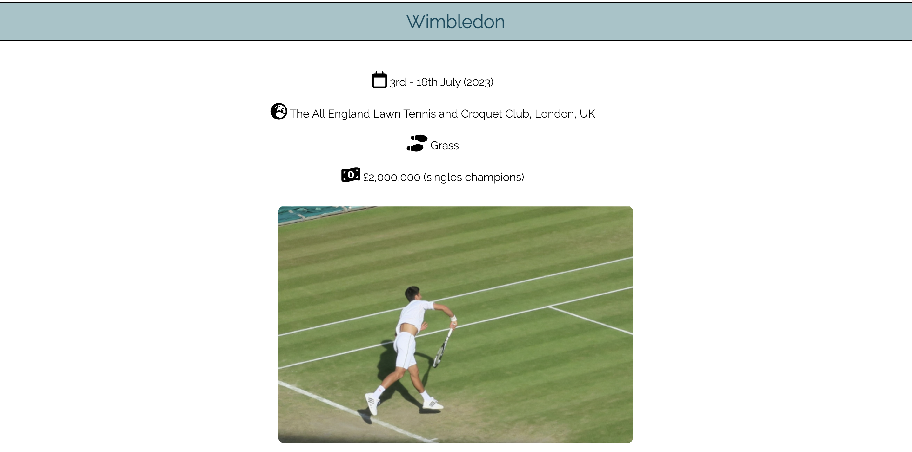
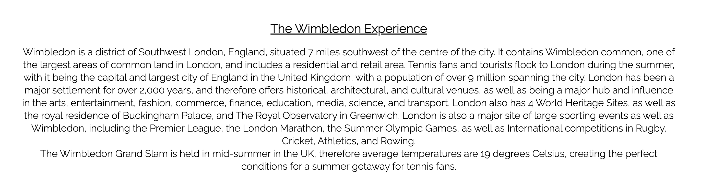

# Tennis Legend

The Tennis Legend website is for people interested in Grand Slam tennis tournaments and want to find out more about each event, some of the best players, and how to buy tickets.

What they will find on this website is the essential information on the history, location, and all-time greats of each event, as well as some of the main attractions in each city. This information is useful for people when they are looking to go on a trip to a large city and want to integrate going to watch a Grand Slam tournament, and who they might see there if they buy or win tickets. 

------

# Features

## Logo & Navigation Bar

* Navigation bar featured at the top of the page, showing the name of the website in the left corner: Tennis Legend. This links to the home page. 
* Other navigation links are to the right: Home, Event Details, Who’s Playing, and Sign Up, which link to different sections of the site. 
* The Navigation Text is in a sport-style font, in a color that contrasts with the background of the navigation section. 
* The navigation bar clearly shows the user the name of the website and makes the different sections of information available easy to find and move between. 

## Index Page

* The Hero Image and overlaid text draw the users attention to the fact that this website is an information hub for the Grand Slam tennis tournaments. 
* The text underneath outlines the name of each Grand Slam tournament throughout the year and some facts on why the user should be interested in them. 

## The Footer
* The footer section includes links to the relevant social media sites for Tennis Legend. These links are represented by social media icons and open up into new tabs to improve the user experience. 
* The footer section is valuable to the user as it encourages them to look further into Tennis Legend on all social media sites and stay updated with tennis news, tickets, and competitions.

## Events Page 
* The Events Page outlines details on each Grand Slam tournament. This includes when each one is, the exact location, top players at each one, and key points about the city that each one is held in. 
* This section shows the user important information they need to know about each tournament, what each city offers and how they can buy tickets for the next event. It also inclides a responsive Google Maps Iframe of the stadium location. 

## Players Page
* The players page displays cards for 3 male players and 3 female players to look out for in the next Grand Slam tournaments. Each card includes key facts such as age, number of career titles so far, career prize money so far, and what their current world ranking is. They also include direct links to each players Instagram page, which open up in a new tab. 

* Further down this page there are two YouTube videos demonstrating some of the most exciting plays from some of the mentioned players. These videos can be controlled directly on the Tennis Legend website. 

## Sign Up Form
* The sign up section has a form to collect details from users so that they can enter a draw to win tickets to a Grand Slam. 
* The form collect the user’s first name, last name, and an email address. It also includes a radio button selector for users to indicate a preference of tournament they would like to win tickets for. 
* The form is valuable to the user as it gives them the ability to enter a competition and also be on the mailing list for Tennis Legend for future contact. 

------

# Testing

* I tested that this page works in the different browsers: Chrome, Firefox, and Safari. 
* The Index, Events, and Sign Up pages are responsive, with the style being similar on varying screen sizes. Shown in the image below. —> (Image) 
* The Who’s Playing page is responsive, with the layout changing more significantly on different screen sizes due to the layout of the content. See below; —> (image)
* I confirmed that the navigation bar and header text are all readable and easy to understand. 
* I have confirmed that the form entries work: the name fields accept text and the email field will only accept an email address, and the submit button works and is clear and easy to understand. 

## Validator Testing

- HTML
    - No errors were returned when passing through the official W3C validator. 

- CSS
    - No errors were found when passing through the official (Jigsaw) validator. 

- Accessbility 
    - I confirmed that the colors and fonts chosen are easy to read and accessible by running it through the Lighthouse tool:
 

- Bugs 
    - No unfixed bugs. 

# Deployment 

This site was deployed to GitHub pages. The steps to deploy are as follows:
    * In the GitHub repository, navigate to the Settings tab. 
    * From the source section drop-down menu, select the Master Branch. 
    * Once the Master Branch has been selected, the page provided links to the completed website.

The live link can be found here: [insert live link]

# Credits
Thank you to my mentor Anthony who guided me through my first project.

### Content
* The code to make the social media links in the footer was taken from the [love running](https://learn.codeinstitute.net/courses/course-v1:CodeInstitute+LR101+2021_T1/courseware/) CI Project. 
* The Icons in the header, Event Details Page, Who’s Playing page, and footer were taken from [Font Awesome](https://fontawesome.com/icons).
* The fonts used in the website were taken from [Google Fonts](https://fonts.google.com/).
* Text was written by myself utilising facts gathered from desk-based research. 
* Inspiration for the hero image was taken from the Love Running Walkthrough Project from www.codeinstitute.net

### Media
* The code to make the pages responsive was inspired by [W3C Schools](https://www.w3schools.com/css/css_rwd_mediaqueries.asp).
- The Hero Image was taken from [Pexels](https://www.pexels.com/). 
- The images on the Event Details page and Sign up form were taken from:
    - [Unsplash](https://unsplash.com/)
    - [Pixabay](https://pixabay.com/)
    - [Pxhere](https://pxhere.com/)
- The Youtube videos on the Players page are taken from the Tennis TV (https://www.youtube.com/results?search_query=tennis+tv) and Eurosport Tennis (https://www.youtube.com/channel/UCxyDulPLBU9WiiN43xTs5FQ) Channels on YouTube. 
- I take no credit for any of the images or videos displayed on this website and they are used for educational purposes only. I do not make any money by using them. 

